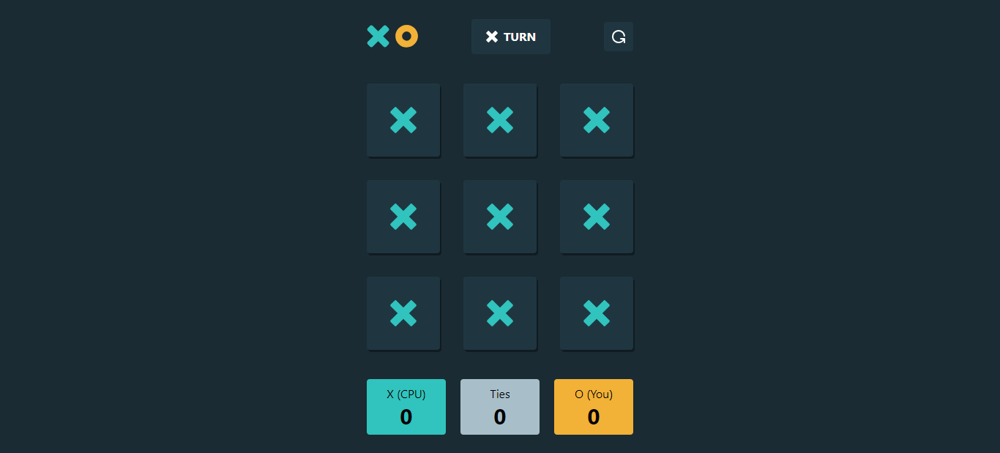
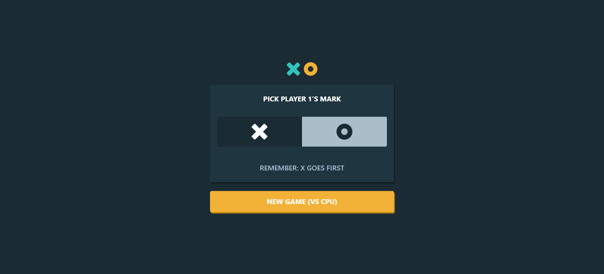
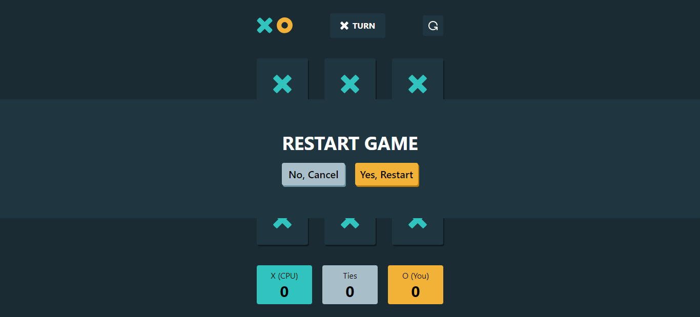

# Tic-Tac-Toe Game - React



This project is a classic Tic-Tac-Toe game implemented with React. It provides an interactive and fun gaming experience. Challenge your friends or play against the computer!

## Table of Contents
- [Features](#features)
- [Demo](#demo)
- [Getting Started](#getting-started)
  - [Prerequisites](#prerequisites)
  - [Installation](#installation)
- [Gameplay](#gameplay)
- [Technical Details](#technical-details)
- [Contributing](#contributing)
- [License](#license)

## Features

- **Player vs. Player**: Challenge your friends in a classic game of Tic-Tac-Toe.
- **Player vs. Computer**: Play against an AI opponent for a single-player experience.
- **Interactive Board**: Click on the grid to make your moves.
- **Winning Logic**: Automatically detects and displays the winner.
- **History Tracker**: Review past moves and game history.

## Screenshots






## Getting Started

Follow these instructions to set up and run the project on your local machine.

### Prerequisites

Before you begin, ensure you have the following software and tools installed:

- [Node.js](https://nodejs.org/) - To manage project dependencies.
- [npm](https://www.npmjs.com/) or [Yarn](https://yarnpkg.com/) - Package manager.

### Installation

1. Clone the project repository:

   ```shell
   git clone https://github.com/tncrayt/tic-tac-toe.git
   ```

2. Navigate to the project directory:

   ```shell
   cd tic-tac-toe
   ```

3. Install project dependencies:

   ```shell
   npm install
   ```

   or

   ```shell
   yarn install
   ```

4. Start the application:

   ```shell
   npm start
   ```

   or

   ```shell
   yarn start
   ```

   This will start the development server, and you can access the game in your web browser.

## Gameplay

The game starts with two players taking turns to place their marks (X and O) on the grid. The first player to achieve a row, column, or diagonal of their marks wins. The game also ends if all cells on the board are filled without a winner, resulting in a draw.

## Technical Details

The game is built using React, utilizing components and state management for the game logic. The AI opponent uses a simple algorithm to make strategic moves in single-player mode. CSS styles provide an interactive and visually appealing game board.

## Contributing

Contributions are welcome! If you have suggestions for improvements, find bugs, or want to add new features, please open an issue or submit a pull request.

## License

This project is licensed under the MIT License. See the [LICENSE](LICENSE) file for details.
```

Bu README dosyası, projenizin teknik yönlerini ve oyunun nasıl oynandığını daha ayrıntılı bir şekilde açıklar ve kullanıcılarına oyunun nasıl başladığını ve oynandığını anlatır. Ayrıca, oyuna ait bir demo bağlantısı ve ekran görüntüleri de içerir.
